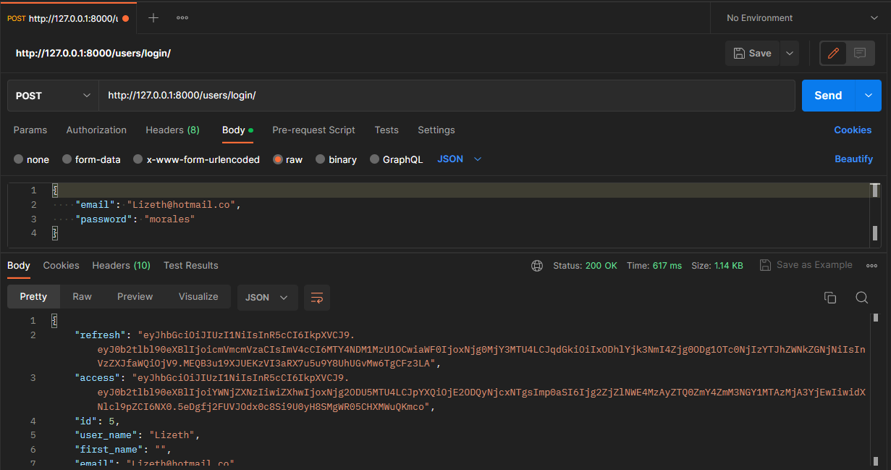

# Forum With Django And React <a href="mailto:florezj328@gmail.com">  </a>

## Requisitos previos

- [Python](https://www.python.org/downloads/)
- [Node](https://nodejs.org/es/download/)
- [DB Browser for SQLite](https://sqlitebrowser.org/dl/)

## Webs de utilidad

- [Django](https://www.djangoproject.com/)
- [Tailwind CSS](https://tailwindcss.com/)
- [Django Tailwind](https://django-tailwind.readthedocs.io/en/latest/installation.html)

---

## Pasos a seguir

```sh
# Clonar el repositorio
git clone https://github.com/Jhonatan2022/Foro-Django-TailwindCSS.git
```

```sh
# Movernos a la carpeta del proyecto
cd .\Foro-Django\
```

```sh
# Crear un entorno virtual
virtualenv env
```

```sh
# Damos permisos en powershell para ejecutar el archivo de activacion
# Ejecutamos powerShell como administrador y ponemos:
Set-ExecutionPolicy RemoteSigned
```

```sh
# Activamos el entorno virtual
env/Scripts/activate
```

```sh
# Instalamos los requerimientos de django
pip install -r requirements.sh
```

```sh
# Nos movemos a la carpeta del frontend
cd .\frontend\
```

```sh
# Instalamos los requerimientos de react
npm install
```

---

## Pasos para correr el aplicativo

```sh
# Nos movemos a la carpeta principal (foro django)
# Corremos el servidor de django
python manage.py runserver
```

```sh
# Nos movemos a la carpeta del frontend y corremos el servidor de react
cd .\frontend\
npm start
```

# Comprobando el backend de Users con Postman

- [Postman](https://www.postman.com/)

## Comprobamos el registro de usuarios


## Comprobamos el login de usuarios



## Comprobamos el actualizado de datos

1. Copiamos el access token que nos devuelve el login y lo pegamos en el campo de autorización de Postman
   
   

## Comprobamos el perfil de usuario


## Comprobamos el obtener solo un usuario


## Comprobamos el obtener todos los usuarios


# Comprobamos el backend de Blogs con Postman

## Comprobamos el crear un Blog Post


## Comprobamos el obtener todos los Blog Post


## Comprobamos el obtener un Blog Post


## Comprobamos el actualizar un Blog Post


## Comprobamos el borrar un Blog Post


# Comprobamos el backend de Comentarios con Postman


